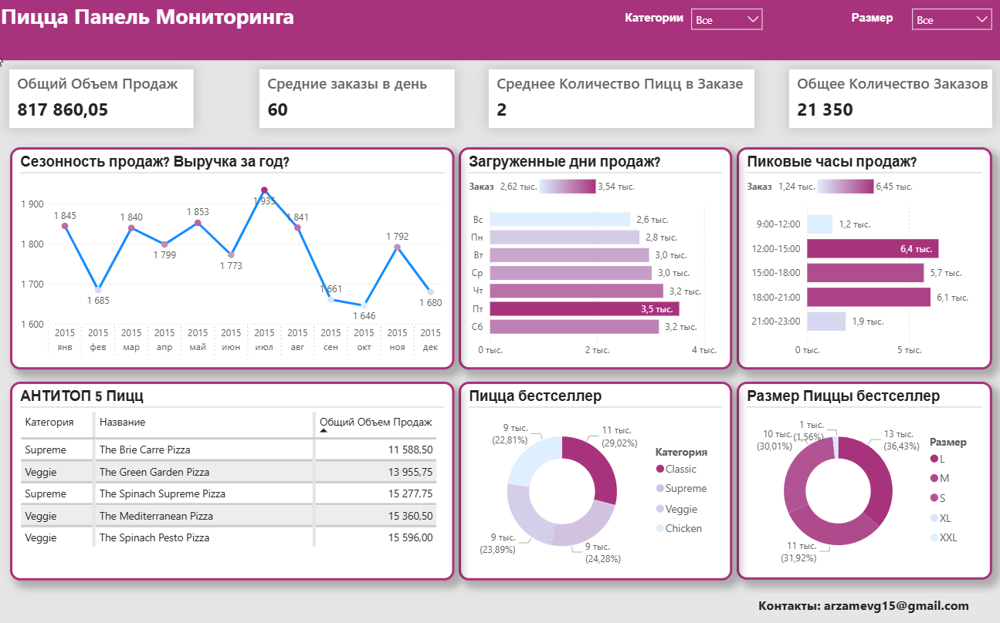

 Анализ продаж пиццерии и визуализация ключевых показателей с помощью Power BI
 
Учебный проект выполнен по видеоуроку на YouTube (с субтитрами на русский яз):

📺 Power BI Pizza Sales Dashboard Tutorial (https://www.youtube.com/watch?v=SbbkNdpn8Jw)

✏️ Описание проекта: 

Цель проекта — проанализировать продажи пиццерии и визуализировать ключевые показатели с помощью Power BI.
Данные взяты из открытого источника: Pizza Place Sales — Maven Analytics Data Playground.(https://mavenanalytics.io/data-playground/pizza-place-sales).

📊Рабочий процесс проекта:

🔹Сбор бизнес-требований: 

Определены основные вопросы для анализа:
Сколько клиентов у нас каждый день? Есть ли часы пик?
Сколько пицц обычно заказывается?
Есть ли пицца-бестселлер?
Сколько денег мы заработали в этом году? Можем ли мы определить какую либо сезонность в продажах?
Есть ли пиццы, которые стоит убрать из меню, или акции, которые можно использовать?
Сбор данных : Использованы данные pizza_sales.csv с сайта Maven Analytics.

🔹Очистка и преобразование данных:
Удалены пустые значения.
Добавлены вычисляемые колонки: Order Date, Order Time, Revenue.
Преобразованы типы данных (дата, время, числовые поля).
Моделирование данных

🔹Создана дата-таблица.
Связи между таблицами по ключевым полям (order_id, pizza_id).
Добавлены меры в DAX для расчета показателей.
Отчет и визуализация данных

🔹Разработан интерактивный дашборд с фильтрацией по дате, типу пиццы и размеру.
Использованы графики: линейный тренд, топ продаж, KPI-карточки, диаграммы.

🔹 Основные инсайты
Есть выраженные часы пик заказов — особенно в обед и вечером.
Определены бестселлеры (пиццы, приносящие наибольшую выручку).
Отмечена сезонность продаж — рост в выходные и праздничные дни.
Некоторые пиццы с низкими продажами можно исключить из меню.

🖼️ Скриншот дашборда

